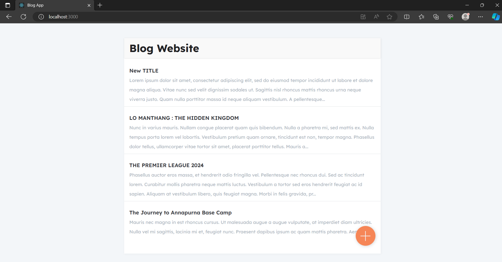
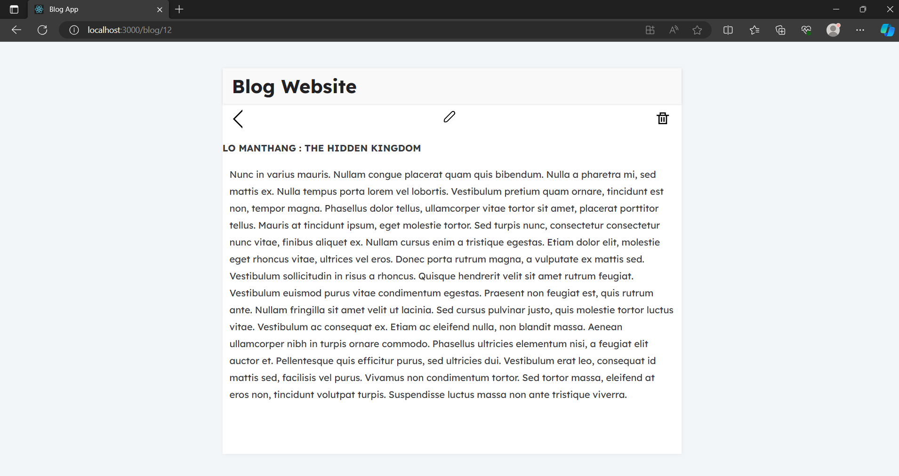
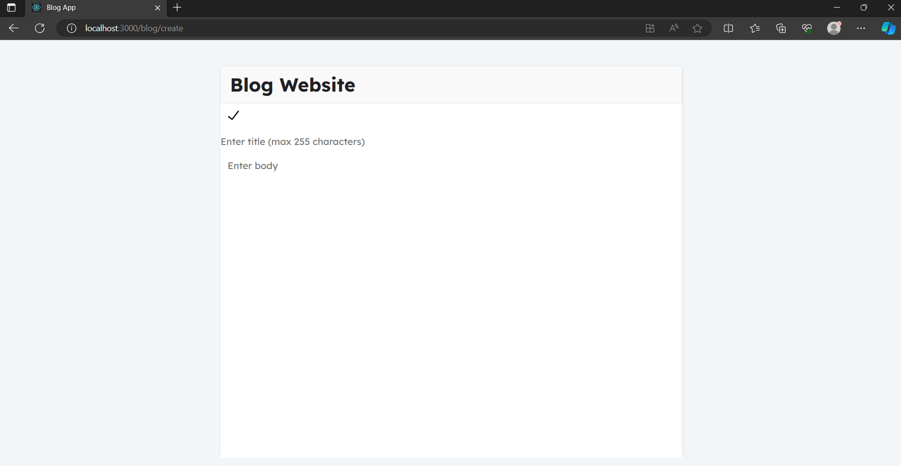

# blog-project

A simple blog app built using React frontend and Django backend

## Description 
This project is a web application that combines a React frontend with a Django backend. It includes basic CRUD operations on the blog posts. The *djangorestframework* is used in order to communicate between the frontend and the backend. It includes a simple and easy to use UI created using React Components and routing is achieved through the *react-router-dom*. The *sqlite* database is used and the model *Post* includes title, body, created_at and updated_at fields.  

## Screenshots

Home Page:


Blog Page:


Create Blog Page:


## Prerequisites  
- Python 
 - Node.js and npm (for React frontend) 
 - Django 
 - virtualenv (optional but recommended for Python environment isolation) 

## Setup Instructions

### Backend (Django)  
1. Create a virtual environment (optional but recommended): 
```
cd blog-project
python -m venv env
```
```
TO ACTIVATE:
WINDOWS : env\Scripts\activate
MAC/LINUX : source env/bin/activate
```
2. Install the required packages:
```
cd blog
pip install -r requirements.txt
```
3. Apply the migrations
```
python manage.py migrate
```
4. Start the django server
```
python manage.py runserver
```   
5. The django server should be running at http://localhost:8000/

### Frontend (React)
1. Navigate to the directory
```
cd blogfrontend
```  
2. Install the packages
```
npm install package.json
```  
3. Start the react server
```
npm start
```  
4. The django server should be running at http://localhost:3000/


## Remember to
1. Update the API base URL in your React app (if needed) to point to your Django backend endpoints.
2. Make sure CORS (Cross-Origin Resource Sharing) is configured correctly in your Django backend to allow requests from your React frontend.

## Troubleshooting

If you encounter any issues during setup or development, refer to the official documentations. 

